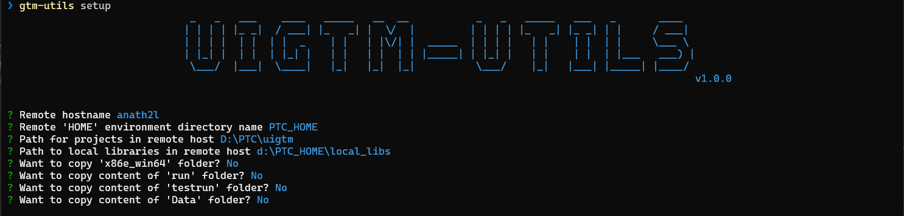

# Getting started

## install _gtm-utils_ application

Follow below steps to install `gtm-utils` on your computer:

1. Install [chocolatey](https://chocolatey.org/install).(if not installed on your computer)
2. Once _chocolatey_ installed, open a **_cygwin_** window in _Administrative_ mode (Run as administrator).
3. Navigate to a directory where you want to store `install.sh` script file. (You can create a new directory)
4. Run the following command:

   > wget -O install.sh https://github.com/abhinath84/gtm-utils/releases/download/V1.0.0/install.sh

   It will download `install.sh` in current directory.

5. Run the following command to install _gtm-utils_ application.

   > sh ./install.sh

6. Wait a few seconds for the command to complete.
7. If you don't see any errors, you are ready to use _gtm-utils_! Open another cygwin window and type `gtm-utils` or `gtm-utls --version`, or see below sections for usage instructions.

## update _gtm-utils_ application

Follow below steps to uninstall `gtm-utils` from your computer:

1. Open a **_cygwin_** window in _Administrative_ mode (Run as administrator).
2. Navigate to a directory where you want to store `update.sh` script file.
3. Run the following command:

   > wget -O update.sh https://github.com/abhinath84/gtm-utils/releases/download/V1.0.0/update.sh

   It will download `update.sh` in current directory.

4. Run the following command to uninstall _gtm-utils_ application.

   > sh ./update.sh

5. Wait a few seconds for the command to complete.
6. If you don't see any errors, _gtm-utils_ application is updated successfully!

## uninstall _gtm-utils_ application

Follow below steps to uninstall `gtm-utils` from your computer:

1. Open a **_cygwin_** window in _Administrative_ mode (Run as administrator).
2. Navigate to a directory where you want to store `uninstall.sh` script file.
3. Run the following command:

   > wget -O uninstall.sh https://github.com/abhinath84/gtm-utils/releases/download/V1.0.0/uninstall.sh

   It will download `uninstall.sh` in current directory.

4. Run the following command to uninstall _gtm-utils_ application.

   > sh ./uninstall.sh

5. Wait a few seconds for the command to complete.
6. If you don't see any errors, _gtm-utils_ application is uninstalled successfully!

## run `setup` command

### Pre-requisite

Below points to be executed on remote machine(example: CoLo machine) where you want to setup uigtm:

- Share directory where uigtm projects will store in remote machine with write permission. That folder's share name must be `projects`.

  Example: on remote computer uigtm project directory name would be `D:\ptc\uigtm` and shared directory name would be `\\anath2d\projects`.

- Share `HOME` _environment_ variable directory in remote machine with write permission.

  Example: Remote `HOME` _environment_ variable directory: `D:\ptc\abc` and shared directory name will be `\\anath2d\abc`.

  > NOTE: once uigtm setup in remote machine is done, unshare `HOME` _environment_ variable directory.

### Run

- Open an command terminal(i.e, Windows Powershell, cygwin etc) on current system where you install `gtm-utils` application.
- Write `gtm-utils setup` command & hit enter.
- Will ask following questions and answer them one-by-one & hit enter

  > Remote hostname
  >
  > Remote 'HOME' environment directory name
  >
  > Path for projects in remote host
  >
  > Path for projects in remote host
  >
  > Want to copy x86e_win64?
  >
  > Want to copy 'run' folder?
  >
  > Want to copy 'testrun' folder?

- Once execution is successful, Please open UIGTM on remote machine & start using it.

### Reference

- You can watch this [demo](./video/gtm_utils_setup.mp4).
