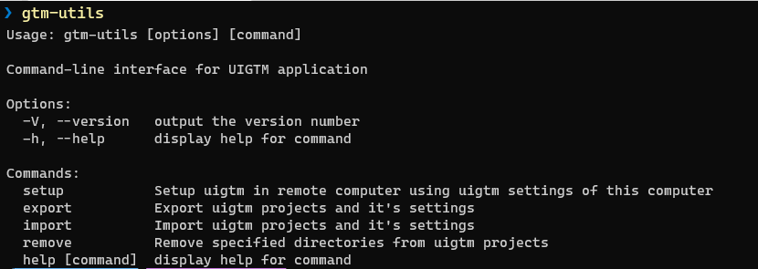

# gtm-utils - An CLI application for uigtm

gtm-utils is a `node.js` based CLI application which provide commands to do stuff related to UIGTM.

Install & other getting started related information, follow [here](./docs/getting%20started.md)

## Commands

Please check [/docs/commands.md](./docs/commands.md)
